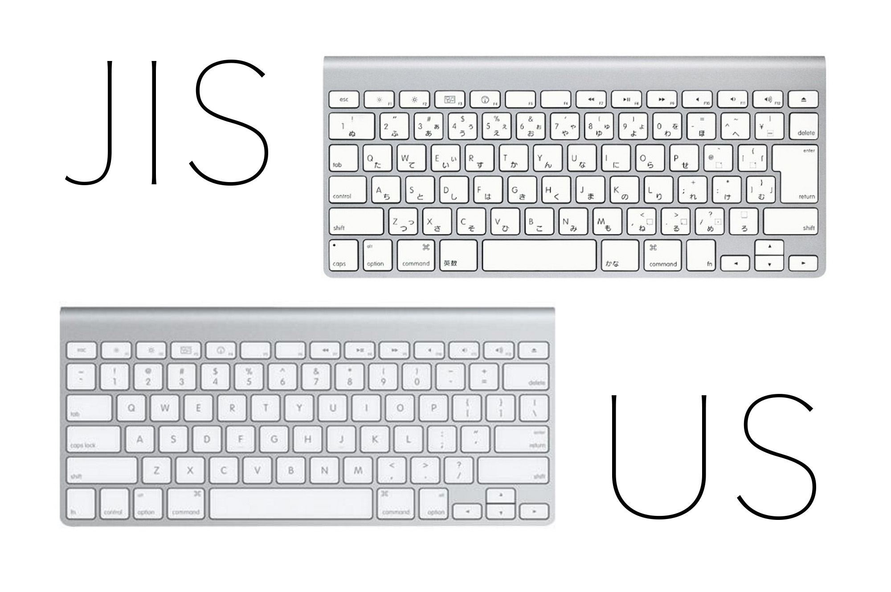

# 概要

## 結論

- US キーボードじゃない mac をお持ちの方は、以下設定をしないで下さい。（無意味なので・・・）

## なにをするの？

- karabina-elements アプリの設定を、とも兄さんのにしちゃいます。

## どうなるの？

- とも兄さんは US キーボードしかダメとか言っちゃってる痛い方です。
- US キーボードでは、「英数」「かな」キーがありません。
  
- そんな US キーボードでも、「英字」「かな」の切り替えをスマートにするために、「左 command を押すと「英字」「かな」が切り替わる設定をします。

# 設定

## Installation

### input tomoyuki original karabina-Elements setting

1. To get inport please open karabiner-elements app:
   
2. Misk > Expoer & Import:
   
3. paste below Inport_file in new macbook '~/.config/karabiner'
